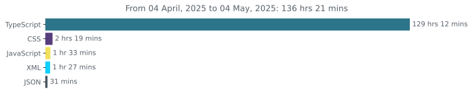

  

 

##

##

##

##

 

###

 

   <h2>Readme Jokes</h2>
 

##

<h1 align="center">
 
</h1>

 

<a href="https://codabytez.wrapped.run">
 <b>GitHub Wrapped</b>
</a>

 
 

 <h1 align="center">
 <a href="https://wakatime.com/@codabytez"> <b> WAKATIME STATS </b>

 
 </a>

###

  

###

  

 

  

###

###

<h2 align="center">TECHS</h2>

###

   &#8287;&#8287;&#8287;&#8287;&#8287;
   &#8287;&#8287;&#8287;&#8287;&#8287;
   &#8287;&#8287;&#8287;&#8287;&#8287;
   &#8287;&#8287;&#8287;&#8287;&#8287;
   &#8287;&#8287;&#8287;&#8287;&#8287;
   &#8287;&#8287;&#8287;&#8287;&#8287;
   &#8287;&#8287;&#8287;&#8287;&#8287;
   &#8287;&#8287;&#8287;&#8287;&#8287;
   &#8287;&#8287;&#8287;&#8287;&#8287;

###

<h2 align="center">SOCIAL MEDIA</h2>

###

  
 &#8287;&#8287;&#8287;&#8287;&#8287;
  
 &#8287;&#8287;&#8287;&#8287;&#8287;
  
  &#8287;&#8287;&#8287;&#8287;&#8287;
   </a>
  

###

<h2 align="center">NOW PLAYING </h2>

###

<h2 align="center">RECENTLY PLAYED</h2>

###

###

<h1 align="center">TROPHIES AND BADGES</h1>

 

    

###

<h4 align="right">

<table>
  <tr>
   
   &nbsp;&nbsp;&nbsp;&nbsp;&nbsp;&nbsp;&nbsp;&nbsp;&nbsp;&nbsp;&nbsp;&nbsp;&nbsp;&nbsp;&nbsp;&nbsp;&nbsp;&nbsp;&nbsp;&nbsp;&nbsp;&nbsp;&nbsp;&nbsp;&nbsp;&nbsp;&nbsp;&nbsp;&nbsp;&nbsp;&nbsp;&nbsp;&nbsp;
   &nbsp;&nbsp;&nbsp;&nbsp;&nbsp;&nbsp;&nbsp;&nbsp;&nbsp;&nbsp;&nbsp;&nbsp;&nbsp;&nbsp;&nbsp;
  </tr>
 </table>

&nbsp;&nbsp;&nbsp;&nbsp;&nbsp;&nbsp;&nbsp;&nbsp;&nbsp;&nbsp;&nbsp;&nbsp;&nbsp;&nbsp;&nbsp;&nbsp;&nbsp;&nbsp;&nbsp;&nbsp;&nbsp;&nbsp;&nbsp;&nbsp;&nbsp;&nbsp;&nbsp;&nbsp;&nbsp;&nbsp;&nbsp;&nbsp;&nbsp;&nbsp;&nbsp;&nbsp;&nbsp;&nbsp;

  

